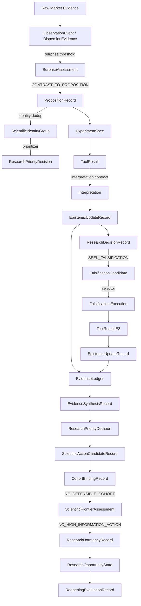

# Phase 3I — End-to-End Autonomous Researcher Graduation Audit

**Mode:** AUDIT + REPLAY + SYSTEM-LEVEL EVALUATION ONLY  
**Date:** 2026-08-22  
**Branch:** `cursor/phase-3i-graduation-audit-aad2`  
**HEAD:** `37546ef2716716f755422c2f5c00fd02c2707a92` (based on 3I.20 dormancy lifecycle integration)  
**PR:** To be opened on this branch  

**NO NEW SCIENTIFIC CAPABILITY IMPLEMENTED. NO MARKET EXPERIMENT EXECUTED. NO NEW TOOLRESULT. NO TRADING CHANGE. NO DEPLOYMENT.**

---

## 1. Branch / HEAD / PR

| Item | Value |
|------|-------|
| Audit branch | `cursor/phase-3i-graduation-audit-aad2` |
| Base commit | `37546ef` (3I.20 `DORMANCY_LIFECYCLE_INTEGRATION_PASS`) |
| OPR module path | `modules/edge_research/opr_bridge/` (63 Python files) |
| Canonical T2 proposition | `prop-efb650d9bd5c451f` |
| Artifacts | `diagnostics/phase_3i_graduation_audit/artifacts/` |
| Verification runner | `diagnostics/phase_3i_graduation_audit/run_phase_3i_graduation_audit.py` |

Prior accepted phase branches: 3I.0–3I.20 (22 phase reports under `diagnostics/phase_3i*/`).

---

## 2. Audit Mode Confirmation

This audit **freezes** the Phase 3I scientific system at commit `37546ef`, **reconstructs** the real T2 proposition lineage from stored artifacts, and **evaluates** system-level autonomy against the North Star.

**Explicitly NOT done:**
- No Phase 3I.21 or other capability implementation
- No failure repair, threshold retuning, or template expansion
- No new market experiment or ToolResult
- No deployment or trading change
- No Zone C guidance

Gaps discovered are **recorded**, not fixed.

---

## 3. Phase 3I Frozen-System Manifest

Full manifest: `artifacts/01_frozen_system_manifest.json`

| Component | Module(s) | Content Hash (audit function) |
|-----------|-----------|-------------------------------|
| OPR bridge | `opr_bridge/` (63 files) | Isolated parallel path |
| OPR generator | `proposition_synthesizer.py` | `opr_generator_v1_3i2` |
| Evidence ingest | `evidence_ingest.py` | — |
| Surprise detector | `surprise_detector.py` | — |
| Proposition synthesizer | `proposition_synthesizer.py` | `CONTRAST_TO_PROPOSITION` only |
| PropositionRecord | `proposition_record.py` | `proposition_record_v1` |
| Scientific birth certificate | embedded in `proposition_record.py` | BC_Q1–Q8 |
| Template-independence evaluator | `template_independence.py` | — |
| Leakage protections | `leakage_audit.py` | — |
| Scientific identity | `scientific_identity.py` | — |
| Observation prioritization | `prioritization.py` | `prioritizer_v1_3i5` |
| Evidence lineage | `evidence_ledger*.py`, `lifecycle_records.py` | — |
| Interpretation contract | `interpretation_contract.py` | — |
| PropositionExperimentInterpreter | `proposition_experiment_interpreter.py` | — |
| Falsification candidate generator | `falsification_candidate_generator.py` | — |
| Falsification selector | `falsification_selector.py` | lexicographic v1 |
| EvidenceSynthesisEngine | `evidence_synthesis_engine.py` | `ee00da71e383…` |
| Lifecycle synthesis hooks | `lifecycle_synthesis_hook.py`, `synthesis_integration.py` | — |
| ScientificActionGenerator | `scientific_action_generator.py` | `77e665c720b3…` |
| EvidenceDerivedCohortBinder | `evidence_derived_cohort_binder.py` | `cfaf175de409…` |
| ScientificFrontierReassessment | `scientific_frontier_reassessor.py` | `bd0c4a0231bc…` |
| Research dormancy mechanism | `dormancy_records.py`, `dormancy_deriver.py` | `a6a70005511d…` |
| Reopening evaluator | `dormant_research_reopening_evaluator.py` | — |
| Lifecycle dormancy integration | `lifecycle_dormancy_integration.py` | `409f55fd2490…` |

**Frozen T2 terminal state (authoritative, not regenerated):**

```
epistemic_state = SUPPORTED
frontier_decision = NO_HIGH_INFORMATION_ACTION
research_activity_state = DORMANT
dormancy_hash = a09db7b6868d11134836ecec419f8a626d1835795469d43f7c20f14b2bc15dc3
```

---

## 4. Capability-History Map (3I.0 → 3I.20)

| Scientific Function | Phase | Implemented Capability | Authoritative Module/Record | Required Human Input | Input Class | Connected to Next? |
|---------------------|-------|------------------------|----------------------------|----------------------|-------------|-------------------|
| **OBSERVE** | 3I.2/3I.3 | Dispersion evidence ingest from panel | `evidence_ingest.py` | Panel CSV, column grammar, legal features | B: EXECUTION_BOUNDARY | Yes → surprise |
| **DETECT SURPRISE** | 3I.2/3I.4 | Quintile spread + monotonicity break | `surprise_detector.py` | Threshold constants (1.5 spread) | C: SCIENTIFIC_PRIOR | Yes → synthesizer |
| **WONDER** | 3I.2 | Surprise text → uncertainty statement | `proposition_synthesizer.py` | CONTRAST_TO_PROPOSITION relation | C: SCIENTIFIC_PRIOR | Yes → proposition |
| **FORM PROPOSITION** | 3I.2/3I.4 | Evidence-derived PropositionRecord | `proposition_record.py` | Uncertainty family enum, relation types | C: SCIENTIFIC_PRIOR | Yes → identity/prioritize |
| **ESTABLISH SCIENTIFIC IDENTITY** | 3I.5 | Semantic dedup across dates | `scientific_identity.py` | Identity key schema | B: DESCRIPTIVE_ONTOLOGY | Yes → prioritize |
| **PRIORITIZE** | 3I.5 | Select canonical proposition among candidates | `prioritization.py` | Prioritization weights | C: SCIENTIFIC_PRIOR | Yes → lifecycle |
| **DESIGN TEST** | 3I.6/3I.7 | ExperimentSpec from proposition draft | `lifecycle_execution.py` | Tool registry, grammar | B: EXECUTION_BOUNDARY | Yes → interpret |
| **INTERPRET EVIDENCE** | 3I.7 | Pre-registered interpretation contract | `proposition_experiment_interpreter.py` | Interpretation thresholds | C: SCIENTIFIC_PRIOR | Yes → epistemic update |
| **UPDATE EPISTEMIC POSITION** | 3I.7 | EpistemicUpdateRecord append-only | `lifecycle_records.py` | State machine rules | A: BOT_DECISION (within rules) | Yes → research decision |
| **SEEK FALSIFICATION** | 3I.7/3I.12 | Falsification-first after SUPPORTING | `lifecycle_records.py`, synthesis | Policy constants | C: SCIENTIFIC_PRIOR | Yes → candidate gen |
| **DESIGN FALSIFICATION** | 3I.8/3I.9 | Candidate generation + lexicographic selection | `falsification_*.py` | Strategy catalog | C: SCIENTIFIC_PRIOR | Yes → execution |
| **SYNTHESIZE MULTIPLE EVIDENCE** | 3I.11/3I.12 | Relationship taxonomy, no vote counting | `evidence_synthesis_engine.py` | 9-class relationship taxonomy | C: SCIENTIFIC_PRIOR | Yes → priority |
| **IDENTIFY UNRESOLVED UNCERTAINTY** | 3I.12 | 9-axis uncertainty coverage | `uncertainty_coverage.py` | Axis vocabulary | C: SCIENTIFIC_PRIOR | Yes → action gen |
| **CHOOSE WHAT IS WORTH LEARNING** | 3I.16 | ScientificObjectiveRecord from synthesis | `scientific_action_generator.py` | Operator catalog, objectives | C: SCIENTIFIC_PRIOR | Yes → cohort bind |
| **Evidence-derived cohort** | 3I.17b | Overlap-based cohort binding | `evidence_derived_cohort_binder.py` | Overlap ceilings | A: BOT_DECISION | Yes → frontier |
| **ASSESS SCIENTIFIC FRONTIER** | 3I.18 | NO_HIGH_INFORMATION_ACTION | `scientific_frontier_reassessor.py` | Marginal info gate rules | A: BOT_DECISION | Yes → dormancy |
| **STOP (marginal info low)** | 3I.19 | DORMANT separate from SUPPORTED | `dormancy_deriver.py` | Reopening condition types | C: SCIENTIFIC_PRIOR | Yes → lifecycle hook |
| **REMEMBER WHY STOPPED** | 3I.19/3I.20 | ResearchDormancyRecord + 8 conditions | `dormancy_records.py` | — | A: BOT_DECISION | Yes → reopening eval |
| **REASSESS WHEN OPPORTUNITY CHANGES** | 3I.19/3I.20 | ReopeningEvaluationRecord | `dormant_research_reopening_evaluator.py` | Opportunity state schema | A: BOT_DECISION | Partial (REOPEN_CANDIDATE only) |

**System-level connection gap:** OPR pipeline is **not** wired to `research_controller.py`. Diagnostic runners (`run_phase_3i*.py`) bridge stages. Class **E: DISCONNECTED_CAPABILITY** at production orchestration layer.

---

## 5. North Star (Frozen for Audit)

> Mr.BOT should behave as an autonomous market researcher, not a formulaic stock scanner and not a template-following experiment machine.

A successful researcher should: observe empirical structure; notice uncertainty; originate falsifiable questions; distinguish scientific identity; prioritize scarce attention; run appropriate tests; interpret relative to prior commitments; revise belief for evidence-causal reasons; seek disconfirmation; synthesize without vote counting; identify unknowns; distinguish unknown from worth-learning; refuse low-information activity; remember why research stopped; reopen only when opportunity materially changes.

**Audit evaluates against this North Star, not test-suite pass rates.**

---

## 6. Autonomy Classification Framework

| Class | Definition |
|-------|------------|
| **A. BOT_SCIENTIFIC_DECISION** | Choice derived from evidence/state without human supplying the answer |
| **B. HUMAN_EXECUTION_BOUNDARY** | Human supplies grammar, columns, tools, budgets, schemas, safety — does not count against autonomy |
| **C. HUMAN_SCIENTIFIC_PRIOR** | Human ontology bounds what can be conceived; autonomy limitation, must be visible |
| **D. HUMAN_SCIENTIFIC_DECISION** | Human selects question, hypothesis, cohort, interpretation, stopping — material autonomy break |
| **E. DISCONNECTED_CAPABILITY** | Capability exists but lifecycle requires external caller to bridge stages |

---

## 7. End-to-End Scientific Causality Graph



**Highlighted edges (autonomy concern):**

| Edge | Cause | Class | Concern |
|------|-------|-------|---------|
| RME → OE | Panel scan + feature selection | B + C | Only `rs_spread` dispersion primitive demonstrated |
| SD → PR | CONTRAST_TO_PROPOSITION synthesizer | C | Single synthesis relation; templates predetermine family |
| PR → ES | Proposition draft → tool mapping | A within catalog | Tool choice bounded |
| RD → FC | Falsification-first policy | C | Policy is human-encoded |
| SYN → RPD | Synthesis engine priority rules | A | Within human axis taxonomy |
| SAG → CB | Evidence-derived overlap | A | Demonstrated evidence-causal |
| CB → SFA | All cohorts rejected | A | Rational silence |
| SFA → DR | Marginal information gate | A | Evidence-causal stop |
| Session → RME | **No production auto-trigger** | **E** | **Orchestration disconnect** |
| Legacy controller → TR | Parallel template path | **PARALLEL_AUTHORITY** | Can operate independently |

**Leakage protections:** Interpretation contract hash-locked; synthesis uses pre-result specs; cohort binder prohibits outcome columns; dormancy forbids profitability/Zone C triggers. No identified backward leakage path in frozen chain.

---

## 8. Historical Real-Chain Reconstruction

Canonical chain: `artifacts/02_historical_chain_reconstruction.json`

**Summary (10 transitions, T2 proposition `prop-efb650d9bd5c451f`):**

| Step | Transition | Autonomy Class |
|------|------------|----------------|
| 1 | Evidence → surprise → proposition birth | A within C (CONTRAST_TO_PROPOSITION) |
| 2 | Identity dedup + prioritization | A |
| 3 | E1 → SUPPORTING → SUPPORTED → SEEK_FALSIFICATION | A |
| 4 | Autonomous falsification selection: `fc-independent_episode_holdout` | A |
| 5 | E2 holdout → second SUPPORTING (97.7% overlap) | A |
| 6 | Synthesis → 9 unresolved axes, episode_robustness redundant | A |
| 7 | Action generator → objectives from unresolved axes | A within C (operator catalog) |
| 8 | Cohort binder → NO_DEFENSIBLE_COHORT | A |
| 9 | Frontier → NO_HIGH_INFORMATION_ACTION | A |
| 10 | Dormancy → DORMANT + 8 reopening conditions | A |

**Central counterfactual:** Once the chain is initiated, all 10 transitions derive from prior state + frozen rules. No step required a human to supply the scientific answer for this proposition.

---

## 9. Remove-Human Counterfactual Audit

**Preserved:** data, legal grammar, tools, schemas, budgets, safety boundaries, frozen execution permission.

| Stage | Can next state be derived? | Outcome |
|-------|---------------------------|---------|
| Market observation → OPR trigger | No automatic production trigger | **STOPS_DISCONNECTED_CAPABILITY** |
| Surprise → proposition | Yes for dispersion anomalies | CONTINUES_AUTONOMOUSLY |
| Proposition → experiment | Yes | CONTINUES_AUTONOMOUSLY |
| Evidence → epistemic update | Yes | CONTINUES_AUTONOMOUSLY |
| Falsification selection | Yes | CONTINUES_AUTONOMOUSLY |
| Multi-evidence synthesis | Yes | CONTINUES_AUTONOMOUSLY |
| Action → cohort → frontier → dormancy | Yes | CONTINUES_AUTONOMOUSLY |
| Anomaly outside observation grammar | No synthesis path | **STOPS_HUMAN_SCIENTIFIC_PRIOR** |
| Legacy controller path | Independent template research | **STOPS_PARALLEL_AUTHORITY** |

---

## 10. Earliest Autonomy Break

**Earliest break: Session orchestration (production layer)**

- **Class:** E — DISCONNECTED_CAPABILITY
- **Location:** No path from live market panel → OPR pipeline in `research_controller.py`
- **Evidence:** `research_controller.py` imports `research_actions`, `research_planner`, `research_interpreter` — zero `opr_bridge` references. OPR `__init__.py` explicitly states parallel experimental capability not connected to live trading/planner.
- **Implication:** If human/ChatGPT disappeared after providing infrastructure, **no new OPR research session would start** in production. The frozen T2 chain would not self-initiate.

Within an initiated diagnostic session, the earliest **scientific prior** break is proposition synthesis: only `CONTRAST_TO_PROPOSITION` on dispersion evidence (Class C, not D).

---

## 11. Template-Dependence Audit

| Domain | Classification | Could discover outside encoded families? |
|--------|----------------|------------------------------------------|
| Observation classes | DESCRIPTIVE_ONTOLOGY + SCIENTIFIC_PRIOR | **No** — dispersion quintile primitive only |
| Proposition synthesis relations | SCIENTIFIC_TEMPLATE | **No** — single `CONTRAST_TO_PROPOSITION` |
| Uncertainty dimensions | SCIENTIFIC_PRIOR | **No** — closed 9-axis vocabulary |
| Scientific objectives | SCIENTIFIC_PRIOR | **No** — derived from axis catalog |
| Action operators | SCIENTIFIC_PRIOR | **No** — fixed operator set (hash `1afd6e02…`) |
| Falsification strategies | SCIENTIFIC_PRIOR | **No** — enumerated in candidate generator |
| Evidence relationship taxonomy | SCIENTIFIC_PRIOR | **No** — 9 deterministic classes |
| Reopening conditions | EVIDENCE_DERIVED + SCIENTIFIC_PRIOR | **Partial** — conditions derived from frontier/binder state but types are enumerated |

**Answer:** Mr.BOT cannot today discover a scientifically useful question/action **outside** currently encoded families. Novel wording within the same family (3I.4 `SCIENTIFICALLY_NOVEL` classification) does not constitute ontology escape.

---

## 12. Creativity Audit

| Dimension | Rating | Evidence |
|-----------|--------|----------|
| **Proposition creativity** | PARTIAL | T2 prop evidence-derived, not catalog lookup (3I.4 BC_Q7); bounded to CONTRAST_TO_PROPOSITION + CROSS_SECTIONAL_DISPERSION |
| **Explanatory creativity** | NOT_DEMONSTRATED | `null_competing_explanation` is template-filled; no autonomous alternative hypothesis generation |
| **Experimental creativity** | PARTIAL | 3I.9 autonomous falsification selection among candidates; within fixed strategy catalog |
| **Strategic creativity** | DEMONSTRATED | 3I.18 rational silence when marginal information low; direction change to NO_HIGH_INFORMATION_ACTION |
| **Frontier creativity** | NOT_DEMONSTRATED | No new researchable axis invented; all axes from human taxonomy |

---

## 13. Evidence-Responsiveness Audit

| Scenario | Behavior Changes? | Evidence |
|----------|-------------------|----------|
| Support vs strong disconfirmation | Yes — epistemic state would change | 3I.12 counterfactuals; interpretation contract |
| Valid vs invalid evidence | Yes — invalid ignored | 3I.12 anti-rescue tests |
| Correlated vs independent evidence | Yes — PARTIAL_REPLICATION marked redundant | T2 synthesis: episode_robustness redundant |
| Contradiction vs replication | Yes — CONFLICTED state path | 3I.12 engine rules |
| Unresolved major axis vs resolved | Yes — drives action objectives | 3I.16 objective generation |
| High-info frontier vs exhausted | Yes — NO_HIGH_INFORMATION_ACTION | 3I.18 T2 |
| Redundant vs independent opportunity | Yes — reopening evaluator distinguishes | 3I.19 CF-D1–D8 |

**Verdict:** Scientific behavior **does** change when evidence implication changes. Responsiveness is demonstrated within the OPR frozen chain. Storing evidence alone is not mistaken for responsiveness.

---

## 14. Anti-Self-Deception Audit

| Protection | Class | Notes |
|------------|-------|-------|
| Threshold shopping | STRONG | Interpretation contract hash-locked per proposition |
| Subgroup mining | STRONG | Cohort binder rejects rescue/subset patterns (3I.17b) |
| Horizon mutation after failure | STRONG | `forbidden_rescue_mutations` in objectives |
| Population rescue | STRONG | Binder rejects population_widen/refine rescue |
| Tool swapping as novelty | PARTIAL | Operator catalog fixed; semantic projection helps identity |
| Repeated correlated confirmation | STRONG | Synthesis marks PARTIAL_REPLICATION redundant |
| Representation-only novelty | PARTIAL | Template independence audit; structural_match can still pass |
| First-come proposition bias | PARTIAL | 3I.4 documented; identity dedup helps |
| Confirmation bias | STRONG | Falsification-first after SUPPORTING |
| Endless falsification | STRONG | Frontier + dormancy gate |
| Endless experimentation | STRONG | NO_HIGH_INFORMATION_ACTION → DORMANT |
| Post-result reinterpretation | STRONG | Contract frozen before execution |
| Hidden benchmark contamination | STRONG | Development firewall in BB fixtures |

**Remaining manufacture path:** Select among human-authored operator/axis catalog to produce apparent progress without ontology escape — mitigated by overlap/cohort binder and marginal information gate.

---

## 15. Scientific Memory Audit

| Memory Requirement | Class | Evidence |
|--------------------|-------|----------|
| What proposition exists | COMPLETE | PropositionRecord + hash |
| Why born | COMPLETE | observation_provenance, birth_certificate |
| Supporting/challenging evidence | COMPLETE | EvidenceLedger, EpistemicUpdateRecords |
| Correlated evidence | COMPLETE | independence_profiles in synthesis |
| Unresolved uncertainties | COMPLETE | synthesis unresolved_axes |
| Research attempted | COMPLETE | experiment refs, falsification package |
| Rejected actions | PARTIAL | cohort binder rejections in provenance |
| Why stopped | COMPLETE | ResearchDormancyRecord.dormancy_reason |
| Reopening conditions | COMPLETE | 8 ReopeningConditionRecords |

**Overall: PARTIAL** — complete within diagnostic artifact lineage; **not production-persistent** across sessions. `reconstruct_authoritative_state()` in 3I.20 enables cold replay from append-only records when artifacts are available.

---

## 16. Stop/Reopen Intelligence Audit

**Belief / Research Priority / Research Activity distinction:**

| State | T2 Value | Coherent? |
|-------|----------|-----------|
| BELIEF (epistemic) | SUPPORTED | Yes |
| RESEARCH PRIORITY | SEEK_FALSIFICATION (from synthesis) | Yes — priority ≠ activity |
| RESEARCH ACTIVITY | DORMANT | Yes — activity gated by frontier |

**SUPPORTED + DORMANT:** Scientifically coherent. Belief preserved; activity paused for marginal information.

| Test | Result |
|------|--------|
| Redundant data forces activity | No — CF-D1 REMAIN_DORMANT |
| Clock time forces reopening | No — forbidden trigger CLOCK_ELAPSED |
| Attractive returns force reopening | No — forbidden OUTCOME_PROFITABILITY |
| Independent opportunity reopens | Yes — CF-D2 REOPEN_RESEARCH |
| Semantic drift requires new proposition | Yes — CF-D5 NEW_PROPOSITION_REQUIRED |
| Terminal propositions resurrected | No — same proposition_hash required |

**Verdict:** Stopping is evidence-causal (frontier + cohort state), not merely hardcoded terminal rule.

---

## 17. Whole-System Coherence Audit

**Single Source-of-Authority Map:**

| Concept | Authoritative Source | Legacy Duplicate? |
|---------|---------------------|-------------------|
| Epistemic state | EpistemicUpdateRecord (latest) | None in OPR |
| Multi-evidence view | EvidenceSynthesisRecord | None |
| Research priority | ResearchPriorityDecision | Distinct from single-evidence ResearchDecisionRecord ✓ |
| Next experiment action | ScientificActionCandidateRecord (3I.16+) | Legacy planner candidates — **PARALLEL** |
| Cohort definition | CohortBindingRecord (3I.17b) | Removed hardcoded NORMAL/STRESS ✓ |
| Frontier decision | ScientificFrontierAssessment | Legacy research_frontier — **PARALLEL** |
| Research activity | ResearchDormancyRecord / research_activity_state | New in 3I.19/3I.20 ✓ |
| Proposition identity | proposition_hash + scientific_identity | Canonical ✓ |

**Contradictions identified:**
- OPR lifecycle vs `research_controller` — **disconnected**, not contradictory
- 3I.16 legacy winner (population/rolling contrast) vs 3I.17b silence — **correctly resolved** by cohort binder + frontier
- Synthesis hash differs between 3I.13 replay (`syn-668415e243a8`) and 3I.16 generation (`syn-b6bfbc4959c6`) — same scientific content, different synthesis_id from re-run; proposition_hash stable

**No bypass path** within OPR chain that skips synthesis before action generation.

---

## 18. Legacy-Controller Contamination Audit

| Mechanism | Classification | Notes |
|-----------|----------------|-------|
| `research_actions.py` (24 templates) | **PARALLEL_AUTHORITY** | Still generates candidates in production controller |
| GAP-driven candidate generation | **PARALLEL_AUTHORITY** | `research_interpreter.py` |
| `research_planner.py` | **PARALLEL_AUTHORITY** | Independent ranking/selection |
| `research_controller.py` | **PARALLEL_AUTHORITY** | Does not invoke OPR |
| Challenger/discovery pathways | **ISOLATED_LEGACY** | Not wired to OPR |
| Template ranking / ERV | **PARALLEL_AUTHORITY** | Legacy planner metric |
| OPR bridge | **SAFE_SUPPORTING_INFRASTRUCTURE** | Isolated, research-only |

**Material finding:** Legacy Research Brain can still operate independently and could silently dominate production behavior if OPR is not integrated. OPR does not override legacy — it runs in parallel.

---

## 19. Autonomy Boundary Table

| Scientific Function | BOT Decides | Human Constrains | Human Decides | Status |
|---------------------|-------------|------------------|---------------|--------|
| Observe panel structure | ✓ (dispersion) | columns, grammar | feature catalog | PARTIAL |
| Detect surprise | ✓ | thresholds | observation classes | PARTIAL |
| Form proposition | ✓ (within family) | synthesis relation, axes | — | PARTIAL |
| Scientific identity | ✓ | key schema | — | PASS |
| Prioritize observations | ✓ | weights | — | PASS |
| Design experiment | ✓ | tool registry | — | PASS |
| Interpret evidence | ✓ | contract thresholds | — | PASS |
| Revise belief | ✓ | state rules | — | PASS |
| Select falsification | ✓ | strategy catalog | — | PASS |
| Synthesize evidence | ✓ | taxonomy | — | PASS |
| Generate next action | ✓ | operator catalog | — | PARTIAL |
| Bind cohort | ✓ | overlap rules | — | PASS |
| Assess frontier | ✓ | marginal gate | — | PASS |
| Enter dormancy | ✓ | condition types | — | PASS |
| Evaluate reopening | ✓ | opportunity schema | — | PASS |
| **Start research session** | ✗ | — | orchestration | **FAIL** |
| **Novel ontology escape** | ✗ | full ontology | — | **FAIL** |

---

## 20. Researcher-vs-Decision-Tree Adversarial Audit

| # | Case | Would Mr.BOT Handle? | Determining Component | Researcher-like? |
|---|------|---------------------|----------------------|------------------|
| 1 | Anomaly outside observation class | **No** — no trigger | `surprise_detector` (closed classes) | Decision-tree |
| 2 | Familiar anomaly, unexpected shape | **Partial** — surprise fires but same CONTRAST template | `proposition_synthesizer` | Decision-tree |
| 3 | Two explanations, same evidence | **No** — single null template | `proposition_record` | Decision-tree |
| 4 | Evidence points away from objective taxonomy | **Partial** — synthesis marks unresolved but objectives from catalog | `scientific_action_objectives` | Decision-tree |
| 5 | No executable experiment for top uncertainty | **Yes** — NO_DEFENSIBLE_COHORT → silence | `evidence_derived_cohort_binder` | Researcher-like |
| 6 | Contradiction invalidates direction | **Yes** — CONFLICTED path in synthesis | `evidence_synthesis_engine` | Researcher-like |
| 7 | Same proposition, novel evidence structure | **Partial** — if overlap low, action proceeds | `cohort_overlap_estimator` | Researcher-like |
| 8 | Tempting profitable pattern, weak evidence | **Yes** — dormancy forbids profitability triggers | `dormancy_records` | Researcher-like |
| 9 | Repeated supporting, near-total overlap | **Yes** — redundant axis marked | synthesis engine | Researcher-like |
| 10 | New data requires absent concept | **No** — closed ontology | uncertainty_coverage | Decision-tree |

---

## 21. BB-AutonomousResearcher-01 Design (Not Implemented)

**Purpose:** Evaluate complete scientific trajectories, not isolated functions.

**Structure:**
- Abstract development worlds (BB-AR-Dev) + frozen blind worlds (BB-AR-Blind)
- Hidden phenomena inaccessible to Bot (injected via panel, not in code)
- Multiple valid discoveries per world; some worlds correct answer is silence
- Worlds with false initial hypothesis, conflicting evidence, direction-change requirement
- Worlds requiring concept not named in templates

**Scoring dimensions (outcome-neutral):**
grounding, novelty, falsifiability, evidence causality, direction change, anti-rescue, scientific efficiency, rational silence, memory, reopening, autonomy continuity

**Execution firewall:** Same as existing BB pattern — abstract fixtures with development firewall; real chain only post-freeze.

**Not tuned during this audit.**

---

## 22. System-Level Autonomy Scorecard

Full matrix: `artifacts/03_autonomy_scorecard.json`

| Capability | Demonstrated | Partial | Missing |
|------------|:------------:|:-------:|:-------:|
| Observe | ✓ | | |
| Surprise detection | ✓ | | |
| Wonder | ✓ | | |
| Proposition origination | | ✓ | |
| Proposition identity | ✓ | | |
| Prioritization | ✓ | | |
| Test design | ✓ | | |
| Evidence interpretation | ✓ | | |
| Belief revision | ✓ | | |
| Falsification intent | ✓ | | |
| Falsification design | ✓ | | |
| Multi-evidence synthesis | ✓ | | |
| Uncertainty awareness | ✓ | | |
| Research prioritization | ✓ | | |
| Scientific action generation | ✓ | | |
| Evidence-derived cohort | ✓ | | |
| Frontier reassessment | ✓ | | |
| Rational silence | ✓ | | |
| Dormancy | ✓ | | |
| Reopening | ✓ | | |
| Scientific memory | | ✓ | |
| Explanatory creativity | | | ✓ |
| Experimental creativity | | ✓ | |
| Strategic creativity | ✓ | | |
| Frontier creativity | | | ✓ |
| End-to-end autonomy | | ✓ | |

---

## 23. Three Separate Verdicts

### A. Research Primitives
**`AUTONOMOUS_RESEARCH_PRIMITIVES_PASS`**

Individual researcher-like capabilities are demonstrated with phase verdicts: interpretation (3I.7), falsification (3I.9/10), synthesis (3I.12), action generation (3I.16), cohort binding (3I.17b), frontier (3I.18), dormancy (3I.19/20).

### B. Research Lifecycle
**`AUTONOMOUS_RESEARCH_LIFECYCLE_PARTIAL`**

The T2 chain is coherent and evidence-causal when orchestrated, but OPR is not production-connected and legacy controller remains parallel authority. Lifecycle autonomy is demonstrated in diagnostics, not as self-sustaining production process.

### C. Scientific Generality
**`AUTONOMOUS_SCIENTIFIC_GENERALITY_PARTIAL`**

Proposition origination escapes template catalog lookup but not human scientific ontology (CONTRAST_TO_PROPOSITION, closed axes, operator catalog). Cannot invent missing concepts when evidence demands them.

---

## 24. Phase 3I Graduation Decision

**`PHASE_3I_NOT_YET_GRADUATED`**

### Graduation Criteria Assessment

| # | Criterion | Met? |
|---|-----------|------|
| 1 | Genuine proposition origination demonstrated | Partial — within family only |
| 2 | Evidence changes epistemic position | **Yes** |
| 3 | Bot seeks disconfirmation | **Yes** |
| 4 | Multi-evidence avoids vote counting | **Yes** |
| 5 | Uncertainty ≠ research priority | **Yes** |
| 6 | Rational refusal of low-information work | **Yes** |
| 7 | Dormancy/reopening scientifically causal | **Yes** |
| 8 | Scientific memory persistent | Partial — artifacts, not production |
| 9 | No material human scientific decision in T2 chain | **Yes** (within initiated chain; priors encoded not selected) |
| 10 | No legacy override of OPR lifecycle | **No** — PARALLEL_AUTHORITY |

Criteria 8 and 10 fail. Generality limitations are explicit but also block full graduation under criterion 1 partial + criterion 10 fail.

---

## 25. Highest-Leverage Blocker (Exactly One)

**OPR lifecycle is disconnected from the production research controller.**

The demonstrated end-to-end autonomous chain (observation → dormancy) exists only under human-initiated diagnostic orchestration. `research_controller.py` operates the legacy template/GAP pipeline with zero OPR integration. Until the OPR lifecycle is the authoritative production research path (with legacy isolated or subordinated), Mr.BOT cannot function as an autonomous market researcher in actual operation — only as a validated diagnostic subsystem.

Removing this blocker improves autonomous research capability more than any single ontology expansion because it converts demonstrated lifecycle coherence into operational reality.

---

## 26. Strategic Frontier (If Graduated — recorded for when blocker removed)

From audit evidence, the next strategic frontier after production integration would be: **broaden autonomous scientific concept formation** — escape from single `CONTRAST_TO_PROPOSITION` relation and closed uncertainty axis vocabulary so evidence outside current ontology can originate genuinely new research directions.

---

## 27. Minimal Recommended Next Phase (Proposal Only)

**Phase 3J.0 — Production OPR Lifecycle Integration ( wiring-only audit + integration )**

Scope:
- Wire OPR pipeline as authoritative path in research session controller
- Subordinate or gate legacy template planner when OPR proposition active
- Persist append-only lineage to production-accessible store
- No new scientific rules, operators, or thresholds
- Integration audit with remove-human counterfactual re-run

**Do not implement in this audit.**

---

## 28. Explicit Confirmation

- ✅ NO NEW SCIENTIFIC CAPABILITY IMPLEMENTED
- ✅ NO MARKET EXPERIMENT EXECUTED
- ✅ NO NEW TOOLRESULT
- ✅ NO TRADING CHANGE
- ✅ NO DEPLOYMENT

---

# Final Questions

### A. Isolated intelligent behaviors or coherent autonomous lifecycle?

**Both, separately.** Isolated intelligent research behaviors are demonstrated and pass primitives verdict. A coherent lifecycle is demonstrated **within the frozen T2 diagnostic chain**, but it is **not** a production-autonomous lifecycle because orchestration remains external.

### B. Earliest point removing human/ChatGPT stops scientific progress?

**Session start.** Production has no auto-trigger from market evidence to OPR pipeline. Within an initiated chain, progress continues autonomously through dormancy.

### C. Evidence-derived vs human-authored?

| Evidence-Derived | Human-Authored Prior |
|------------------|---------------------|
| Proposition focal content from quintile contrast | CONTRAST_TO_PROPOSITION relation |
| Epistemic updates from interpretation | Interpretation thresholds |
| Falsification candidate selection | Strategy catalog |
| Synthesis relationships | 9-class taxonomy |
| Cohort rejection / silence | Operator catalog, uncertainty axes |
| Dormancy + reopening conditions | Condition type enumerations |

### D. Can it invent missing concepts for evidence outside ontology?

**No.** Closed observation classes, single synthesis relation, and enumerated uncertainty axes prevent concept invention. Rating: NOT_DEMONSTRATED for frontier creativity.

### E. Direction change from evidence vs predefined branch?

**Yes, within rules.** T2 demonstrates evidence-causal silence (cohort failure → frontier → dormancy). Not merely a predefined branch — binder and frontier derive from measured overlap and marginal information. Bounded by human-encoded gate rules.

### F. Knows what it believes, doesn't know, worth learning, when wasteful?

**Yes, with caveats.** SUPPORTED belief + 9 unresolved axes + SEEK_FALSIFICATION priority + NO_HIGH_INFORMATION_ACTION + DORMANT activity. Caveat: "worth learning" is constrained to catalog objectives; cannot propose entirely new learning targets.

### G. Has Phase 3I earned graduation?

**No.** `PHASE_3I_NOT_YET_GRADUATED` — lifecycle partial (production disconnect + legacy parallel authority), generality partial, scientific memory not production-complete.

### H. Single most important strategic frontier?

**Production OPR lifecycle integration** (immediate blocker). Following that: **autonomous scientific concept formation** beyond human-authored ontology.

---

*End of Phase 3I Graduation Audit. STOP — no next phase implementation.*
